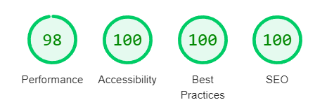

# Portfolio
Salut 👋
Voici ma participation au concours du [Repaire du Web](https://discord.gg/HEYCSjh8)
Projet réalisé en une dizaine de jours
##### Le projet
J'ai créé un portfolio, pour moi, contenant la plupart de mes projets
J'ai choisis, par manque d'inspiration de créer une page en *glass morphism*, le rendu final me plait,
J’ai inclut une apparition au scroll, un 'smart mouse trailer' (source: [Hyperplexed](https://www.youtube.com/watch?v=CZIJKkwc8l8))
J'avais créé une animation sur le titre, qui est d'ailleurs toujours dans le code, je l'ai simplement désactivée car le rendu ne me plaisait pas.
La section About parle de moi, les infos sont véridiques \:)
Les projets sont ajoutés dynamiquement au lancement de la page depuis une base de données, j'ai créé un système de tri par tag dont je suis assez fier.
Pour le contact, j'ai créé un formulaire avec validation en local (dans un projet réel il y aurai aussi une vérification en backend bien sûr)

Il est responsive, accessible, compatible et performant:

Devtools Lighthouse

Je me suis appliqué sur l'accessibilité a laquelle je ne m'était pas encore intéressé, j'ai fait attention à la sémantique HTML, j'ai utilisé aria où c'était nécessaire selon moi. J'apprécierai énormément les retours sur cet aspect du projet sur lequel je peux surement en apprendre encore beaucoup.

Les [technos](#technos-utilisées) que j'ai choisi m'ont permis de créer un code lisible, facilement maintenable et segmenté.

Pour ce qui est des assets, les svg ont été fait sur Figma, pour les miniatures des projets, certaines sont des screens du projets, d'autre des image d'Unsplash, toutes compressées et converti en webp pour les performances.

#####Technos utilisées:
> HTML
> SCSS
> TypeScript

##### Voir le projet:
Voici mon [Portfolio](https://dragonjules.github.io/Portfolio/) pour le concours !
Voici aussi la [repo github](https://github.com/DragonJules/Portfolio) pour voir le code.
